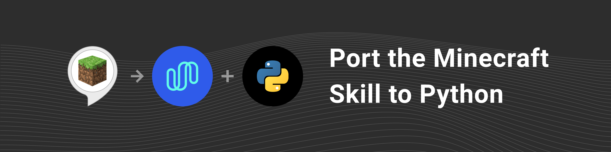

This repository is a Python port of Amazon's [Minecraft Helper NodeJS skill](https://github.com/alexa/skill-sample-nodejs-howto). It uses [Spokestack](https://spokestack.io) to replace Amazon's voice services.

## Setup

    git clone git@github.com:spokestack/minecraft-skill-python.git
    cd minecraft-skill-python

We use `pyenv` for virtual environments. Below you will find the step-by-step commands to install a virtual environment.

    pyenv install 3.7.6
    pyenv virtualenv 3.7.6 minecraft-skill-python
    pip install -r requirements.txt

### TFLite Interpreter

In addition to the Python dependencies, you will need to install the TFLite Interpreter. You can install it for your platform by following the instructions at [TFLite Interpreter](https://www.tensorflow.org/lite/guide/python#install_just_the_tensorflow_lite_interpreter).
**Note:** this is not the full [Tensorflow](https://www.tensorflow.org/) package. However, if you prefer to use the full tensorflow package
you can install it with:

    pip install tensorflow

## Run
Replace `key_id` and `key_secret` in `app.py` with the Spokestack API keys from your account.
Then you can start the project with the following:

    python app.py
